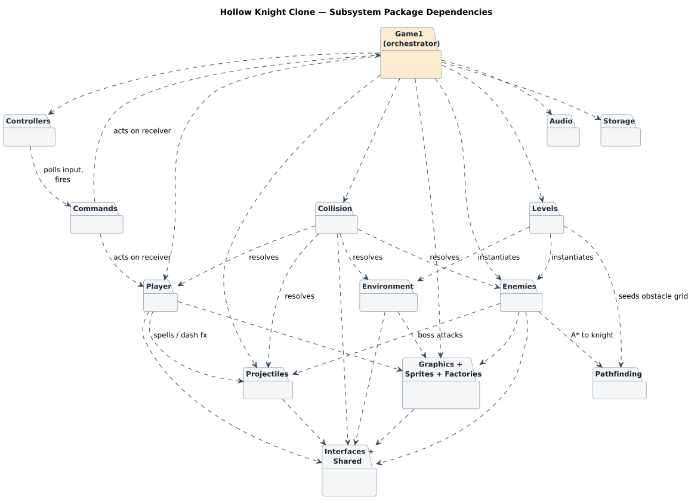
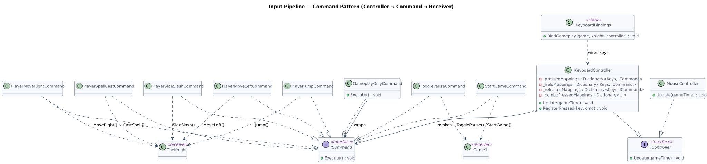
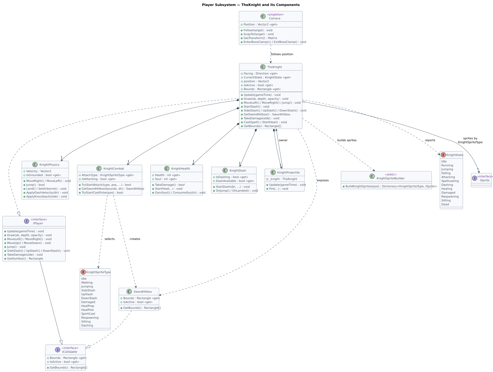
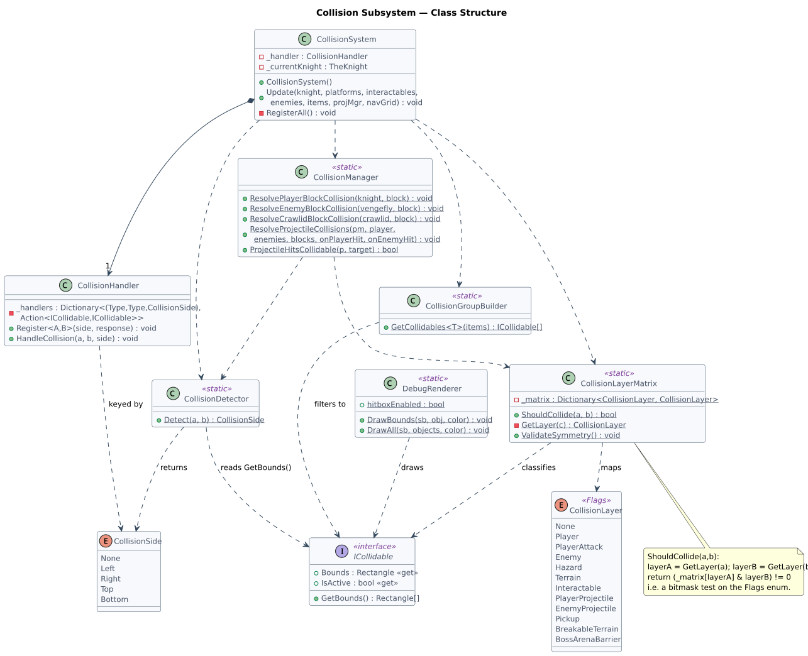
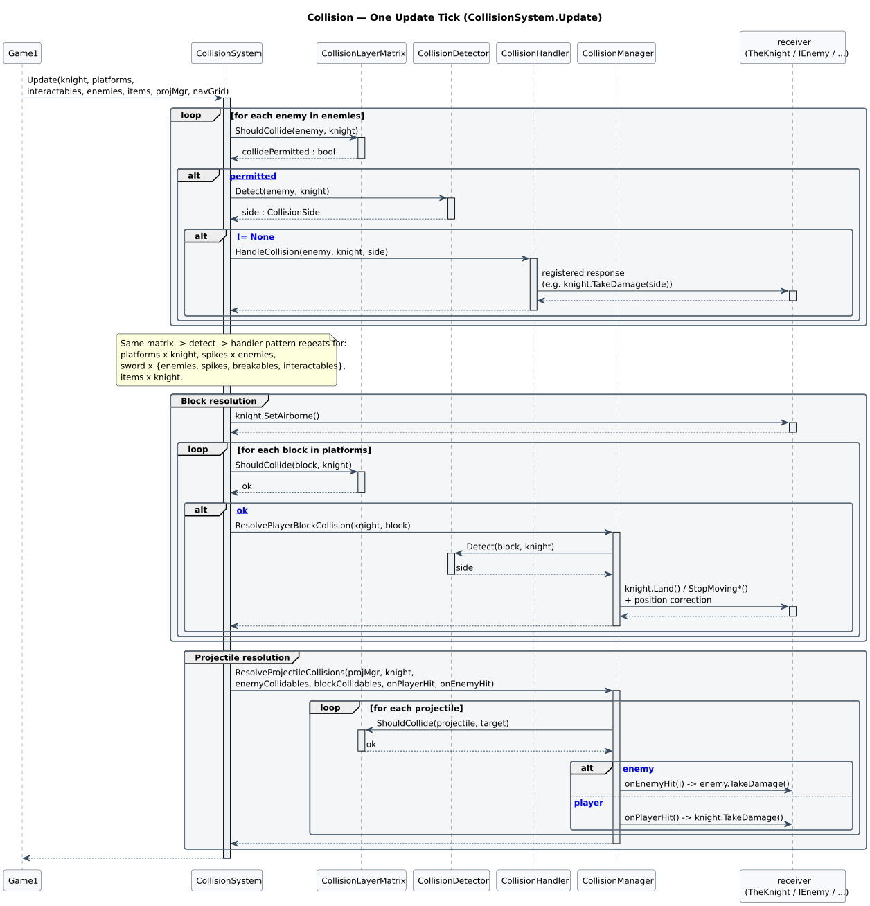
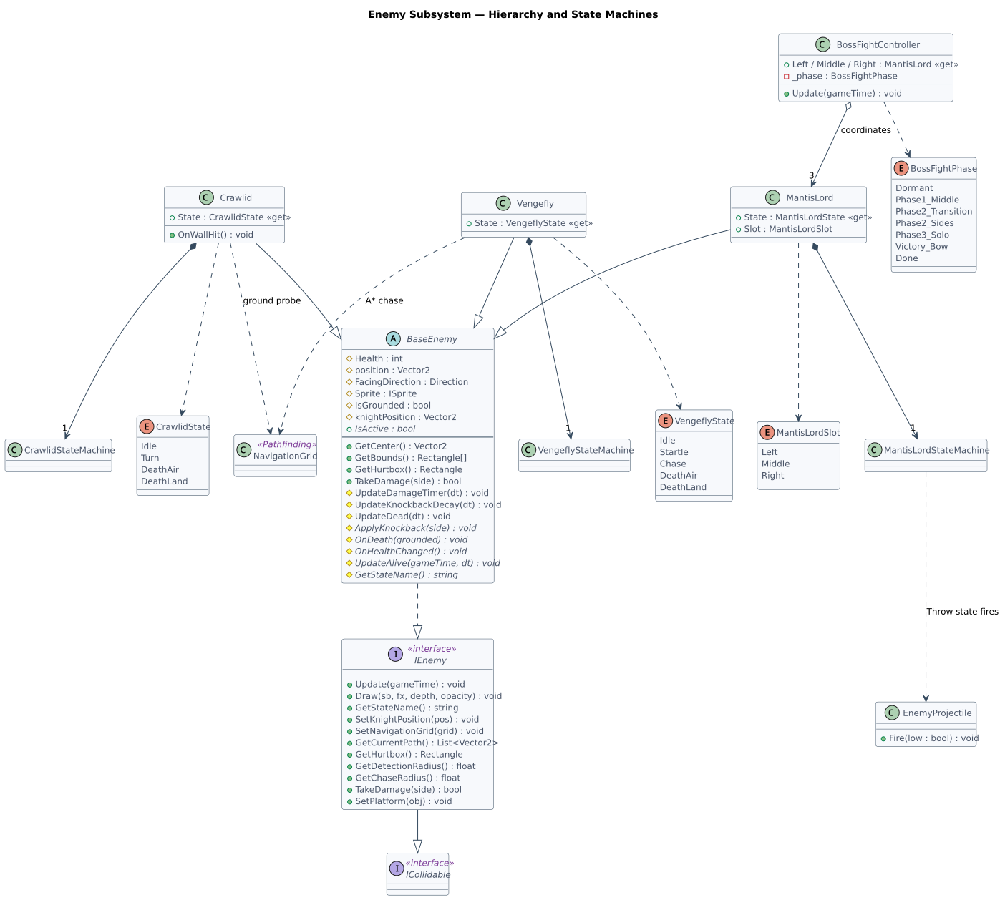
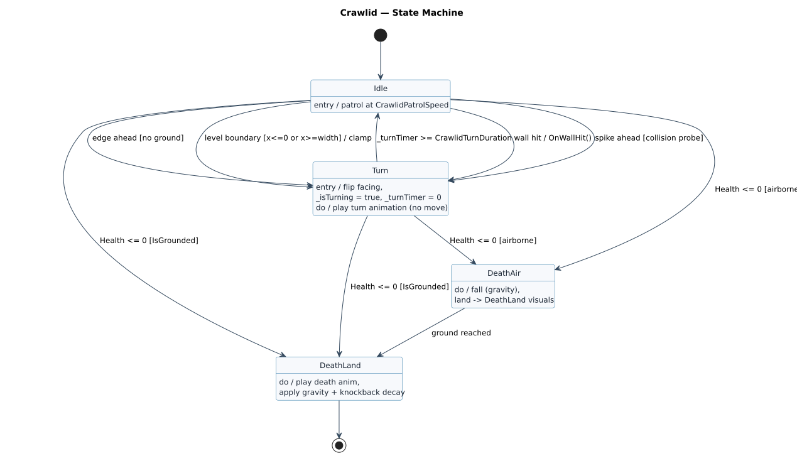
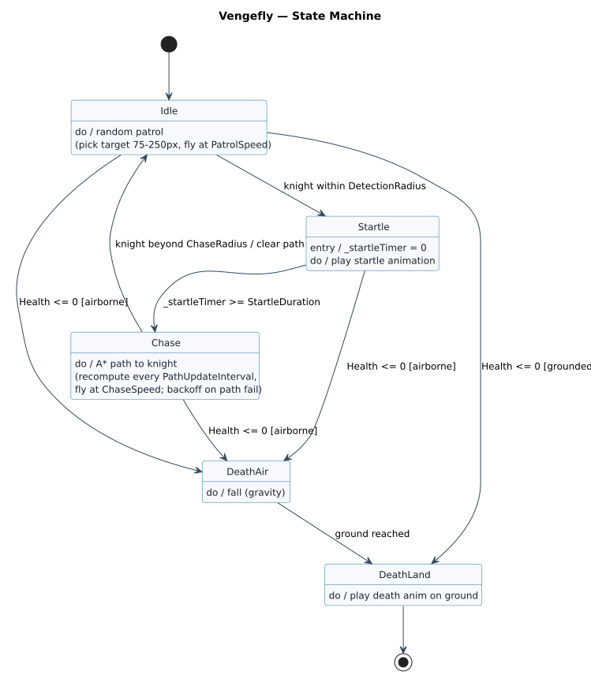
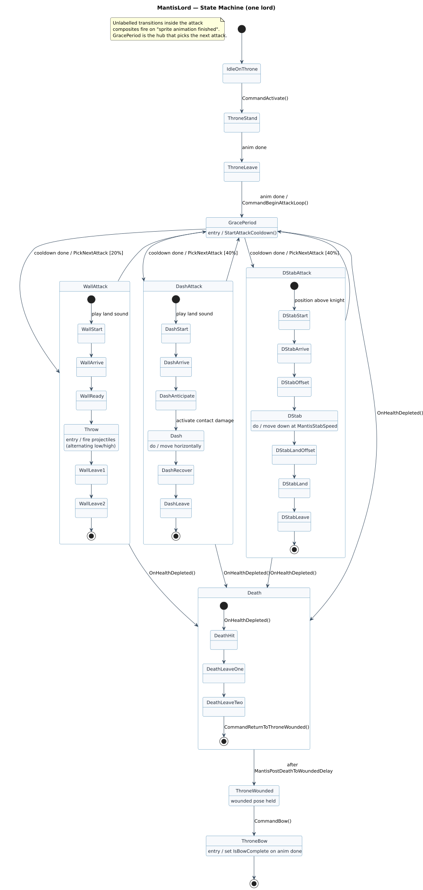
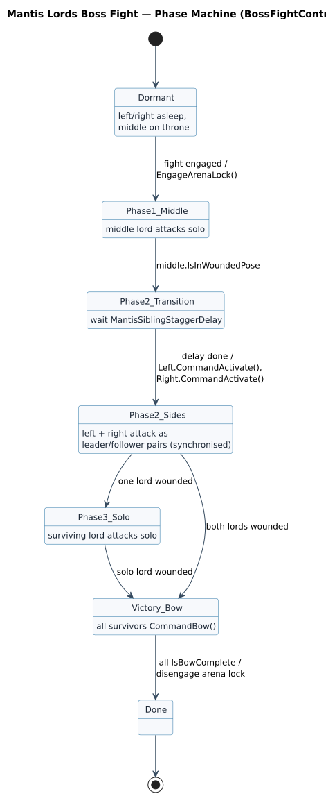

# Hollow Knight Clone — System Design (UML)

| | |
|---|---|
| Project | CSE3902 Team 1 — Hollow Knight clone (MonoGame / C#) |
| Date | 2026-06-12 |
| Status | Reference (personal) |
| Diagram backend | PlantUML 1.2026.2 (UML 2.5.1 notation) |
| Source | `diagrams/*.puml` — rendered to `diagrams/*.svg` |

This document maps the four subsystems of the game as UML: the overall architecture
and input pipeline, the player (`TheKnight`) and its components, the collision pipeline,
and the enemy AI state machines. It is written for understanding the code, not as a spec —
every diagram is derived from the current `dev` branch. A notation legend is in the
[appendix](#appendix-notation-legend).

To re-render after editing a source file:

```bash
cd Docs/design/diagrams && plantuml -tsvg *.puml
```

---

## 1. Overall Architecture

### 1.1 Subsystem dependencies

`Game1` is a partial class spread across `Game1.cs`, `Game1.Initialize.cs`, `Game1.Update.cs`,
`Game1.Draw.cs`, `Game1.State.cs`, and `Game1.Hud.cs`. It is the orchestrator: it owns every
manager and drives `Update()`/`Draw()` each frame. The diagram below shows which subsystems it
drives and the major cross-subsystem dependencies (input → commands → player; levels build
enemies and seed the navigation grid; collision resolves player/enemy/environment/projectiles).


*Figure 1. Package-level dependency map. Dashed open arrows read as "depends on / drives".*

<details><summary>Diagram source</summary>

```plantuml
@startuml architecture
!include _style.puml
title Hollow Knight Clone — Subsystem Package Dependencies
' (see diagrams/architecture.puml)
@enduml
```
*(full source in `diagrams/architecture.puml`)*
</details>

### 1.2 Input pipeline — Command pattern

Controllers implement `IController` and are polled once per frame from `Game1.Update`. A
`KeyboardController` holds dictionaries of `Keys → ICommand` (separate maps for pressed / held /
released, plus combos). `KeyboardBindings.BindGameplay` wires the maps at init. Each command is a
thin object implementing `ICommand.Execute()` that calls a method on a **receiver** — usually
`TheKnight` (movement/combat) or `Game1` (game-state). Gameplay commands are wrapped in
`GameplayOnlyCommand`, which gates them on the current game state so input is ignored on the
title/pause screens.


*Figure 2. Controller → Command → Receiver. `GameplayOnlyCommand` decorates a wrapped command.*

<details><summary>Diagram source</summary>

```plantuml
@startuml command-pattern
!include _style.puml
' (see diagrams/command-pattern.puml)
@enduml
```
*(full source in `diagrams/command-pattern.puml`)*
</details>

---

## 2. Player Subsystem

`TheKnight` realizes `IPlayer` (which itself extends `ICollidable`). Rather than being a
monolith, it **composes** five behavioural components — `KnightPhysics`, `KnightCombat`,
`KnightHealth`, `KnightDash`, and `KnightProjectile` — each owning one slice of state. The
components are mostly independent (no cross-references); `KnightProjectile` holds a back-reference
to its owner. Animation is data-driven: `KnightSpriteBuilder` builds a `Dictionary<KnightSpriteType, ISprite>`
that `TheKnight` selects from by state. `SwordHitbox` is an ephemeral `ICollidable` produced by
`KnightCombat` on each attack. `Camera` (singleton) follows the knight's position.


*Figure 3. `TheKnight` and its components. Filled diamonds = composition (parts die with the knight).*

<details><summary>Diagram source</summary>

```plantuml
@startuml player
!include _style.puml
' (see diagrams/player.puml)
@enduml
```
*(full source in `diagrams/player.puml`)*
</details>

---

## 3. Collision System

### 3.1 Structure

The pipeline is split into single-responsibility pieces. `CollisionSystem` is the only
stateful instance (it owns a `CollisionHandler` and runs the per-frame `Update`). The rest are
**static utilities**:

- `CollisionLayerMatrix` — a bitmask `Flags` enum (`CollisionLayer`) plus a layer→mask table.
  `ShouldCollide(a, b)` classifies each object to a layer and returns `(_matrix[layerA] & layerB) != 0`.
- `CollisionDetector` — AABB overlap test returning which `CollisionSide` of A was hit.
- `CollisionHandler` — a `(TypeA, TypeB, Side) → Action` registry; `HandleCollision` looks up and
  invokes the registered response (e.g. `knight.TakeDamage(side)`).
- `CollisionGroupBuilder` — filters a typed array down to its `ICollidable` members.
- `CollisionManager` — position-correction resolvers for player/enemy/projectile vs. blocks.


*Figure 4. Collision subsystem classes. `«static»` marks utility classes with no instance state.*

<details><summary>Diagram source</summary>

```plantuml
@startuml collision-class
!include _style.puml
' (see diagrams/collision-class.puml)
@enduml
```
*(full source in `diagrams/collision-class.puml`)*
</details>

### 3.2 One update tick

Every collision pass follows the same shape: **filter by layer matrix → detect overlap →
dispatch handler**. Trigger-style passes (damage, pickups, sword hits) go through
`CollisionHandler`; resolution passes (standing on blocks, projectile hits) go through
`CollisionManager`, which corrects positions and invokes callbacks. The sequence below shows the
enemy-vs-knight pass in full, then summarizes the block and projectile passes.


*Figure 5. `CollisionSystem.Update` for one frame. Solid arrows = synchronous calls; dashed = returns.*

<details><summary>Diagram source</summary>

```plantuml
@startuml collision-sequence
!include _style.puml
' (see diagrams/collision-sequence.puml)
@enduml
```
*(full source in `diagrams/collision-sequence.puml`)*
</details>

---

## 4. Enemy AI

### 4.1 Hierarchy

`IEnemy` extends `ICollidable` and adds the AI contract (knight tracking, navigation grid,
pathfinding debug, damage). `BaseEnemy` is the abstract base implementing the shared
damage/knockback/death-gravity logic, with abstract hooks (`UpdateAlive`, `ApplyKnockback`,
`OnDeath`, …) for subclasses. `Crawlid`, `Vengefly`, and `MantisLord` each extend it and **own a
state machine** plus a state enum. `BossFightController` coordinates the three `MantisLord`
instances; `MantisLordStateMachine` fires `EnemyProjectile` during its Throw state.


*Figure 6. Enemy hierarchy. Hollow triangles = inheritance/realization; filled diamonds = owned state machines.*

<details><summary>Diagram source</summary>

```plantuml
@startuml enemy-class
!include _style.puml
' (see diagrams/enemy-class.puml)
@enduml
```
*(full source in `diagrams/enemy-class.puml`)*
</details>

### 4.2 Crawlid

A ground patroller. It walks at a constant speed and flips into a brief `Turn` (locked for
`CrawlidTurnDuration`) whenever it hits a wall, a spike, a platform edge, or the level boundary.
Death branches on whether it was grounded at the moment health reached zero.


*Figure 7. Crawlid states. Transition labels are `event [guard] / action`.*

<details><summary>Diagram source</summary>

```plantuml
@startuml crawlid-state
!include _style.puml
' (see diagrams/crawlid-state.puml)
@enduml
```
*(full source in `diagrams/crawlid-state.puml`)*
</details>

### 4.3 Vengefly

A flyer with detect → startle → chase behaviour. It random-patrols until the knight enters
`DetectionRadius`, plays a `Startle` for `StartleDuration`, then `Chase`s via A* (recomputing on
an interval, with exponential backoff on path failures) until the knight leaves `ChaseRadius`.


*Figure 8. Vengefly states.*

<details><summary>Diagram source</summary>

```plantuml
@startuml vengefly-state
!include _style.puml
' (see diagrams/vengefly-state.puml)
@enduml
```
*(full source in `diagrams/vengefly-state.puml`)*
</details>

### 4.4 Mantis Lord (single lord)

The boss is the most complex machine. After leaving the throne it loops through `GracePeriod`
(the hub), which on cooldown calls `PickNextAttack` to enter one of three attack composites —
**Wall** (20%), **Dash** (40%), or **DStab** (40%). Internal transitions inside a composite fire
on "sprite animation finished". `OnHealthDepleted` can interrupt any state into the `Death`
composite, which ends in a held `ThroneWounded` pose; `CommandBow` later plays the victory bow.


*Figure 9. One Mantis Lord. Composite states group each attack sequence; GracePeriod is the attack-select hub.*

<details><summary>Diagram source</summary>

```plantuml
@startuml mantislord-state
!include _style.puml
' (see diagrams/mantislord-state.puml)
@enduml
```
*(full source in `diagrams/mantislord-state.puml`)*
</details>

### 4.5 Boss fight phases

`BossFightController` runs a separate, higher-level machine over the three lords: the middle lord
fights solo, then the two side lords awaken and attack as synchronized leader/follower pairs, down
to a solo survivor, then a victory bow. Each individual lord runs its own machine (Figure 9)
inside these phases.


*Figure 10. `BossFightController` phase machine.*

<details><summary>Diagram source</summary>

```plantuml
@startuml bossfight-phase
!include _style.puml
' (see diagrams/bossfight-phase.puml)
@enduml
```
*(full source in `diagrams/bossfight-phase.puml`)*
</details>

---

## Appendix: Notation legend

**Class / structure diagrams**

- Solid line + hollow triangle = **generalization** (inheritance, "is-a").
- Dashed line + hollow triangle = **realization** (implements an interface).
- Filled diamond = **composition** (part's lifetime tied to the whole).
- Hollow diamond = **aggregation** (whole references parts that can outlive it).
- Dashed + open arrow = **dependency** ("uses").
- Numbers on association ends (`1`, `*`, `0..1`, `1..*`) = **multiplicity**.
- `«interface»`, `«static»`, `«singleton»`, `«Flags»` = stereotypes. `+ - #` = public / private / protected.

**Sequence diagram**

- Solid line + filled arrowhead = synchronous call; dashed line + open arrowhead = reply.
- Thin bar on a lifeline = activation (object is executing).
- `alt` / `loop` / `group` boxes = combined fragments; guards in `[brackets]`.

**State machine diagrams**

- Filled circle = initial pseudostate; filled circle in a ring = final state.
- Transition label = `event [guard] / action`.
- `entry /`, `do /`, `exit /` = state activities. Nested boxes = composite states.
